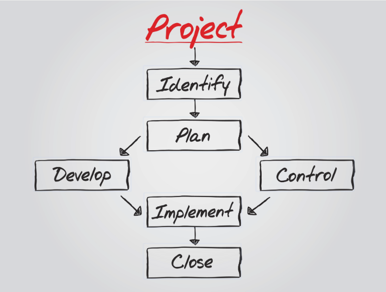

# Approval Workflow trong giai đoạn Khởi động

## Phần 1: Khung kiến thức chuyên sâu (Knowledge Framework)

Trong quản lý dự án theo chuẩn PMP, **Quy trình Phê duyệt (Approval Workflow)** nằm trong Vùng kiến thức Quản lý Tích hợp Dự án (Project Integration Management) và Quản trị Dự án (Project Governance).


Quy trình phê duyệt bao gồm 2 cấu phần chính:

1. **Cổng Phê duyệt Giai đoạn (Phase Gates / Stage Gates):** Các điểm kiểm soát chất lượng tại ranh giới giữa các giai đoạn, ví dụ chuyển từ Khởi động `Initiation` sang Lập kế hoạch `Planning`, hoặc từ Thiết kế `Design` sang Lập trình `Development`. Dự án chỉ được chuyển sang giai đoạn sau khi đạt được "Green Light" (sự đồng ý bằng văn bản/ký duyệt) từ Nhà tài trợ và Ban quản trị.
2. **Quy trình Kiểm soát Thay đổi (Change Control Workflow):** Luồng xử lý khi có bất kỳ đề xuất thay đổi nào về Phạm vi, Tiến độ, Ngân sách hoặc Kiến trúc Kỹ thuật so với Đường cơ sở (Baseline) đã phê duyệt.

### 4 Nguyên tắc vàng trong xây dựng Approval Workflow

- **Tính Minh bạch (Transparency):** Mọi thành viên đều biết rõ ai là người có thẩm quyền ra quyết định cuối cùng cho từng loại mục.
- **Thời gian Phản hồi (SLA Approval):** Quy định rõ thời gian tối đa để một người có thẩm quyền duyệt hoặc bác bỏ yêu cầu, tránh tình trạng nghẽn tiến độ do chờ đợi.
- **Phân cấp Thẩm quyền (Delegation of Authority - DOA):** Quản lý Dự án (PM) được trao quyền quyết định trong một hạn mức nhất định; chỉ những thay đổi vượt hạn mức mới leo thang (Escalate) lên Sponsor hoặc CFO.
- **Vết Kiểm toán (Audit Trail):** Mọi quyết định phê duyệt bắt buộc phải lưu vết qua Email, hệ thống Jira/Confluence hoặc Biên bản ký duyệt (Sign-off Sheet).

---

# Phần 2: Quy trình Phê duyệt Cổng Giai đoạn Khởi động (Initiation Phase Gate Workflow)

Sơ đồ bên dưới thể hiện luồng phê duyệt từ khi phát sinh ý tưởng dự án cho đến khi tổ chức cuộc họp Kickoff chính thức:

```text
┌────────────────────────────────────────────────────────────────────────┐
│                        BƯỚC 1: SOẠN THẢO HỒ SƠ                         │
│  PM & BA hoàn thiện: Business Case, Project Vision, High-Level Scope   │
└────────────────────────────────────────────────────────────────────────┘
                                   │
                                   ▼
┌────────────────────────────────────────────────────────────────────────┐
│                   BƯỚC 2: THẨM ĐỊNH NỘI BỘ (REVIEW)                    │
│  • Tech Lead: Đánh giá tính khả thi Kỹ thuật (AI, eKYC, Cloud)         │
│  • Ops Head: Đánh giá quy trình vận hành CMS                           │
└────────────────────────────────────────────────────────────────────────┘
                                   │
                                   ▼
┌────────────────────────────────────────────────────────────────────────┐
│                 BƯỚC 3: THẨM ĐỊNH TÀI CHÍNH (FINANCE)                  │
│  CFO rà soát: Dòng tiền, ROI, Chi phí API & Tổng ngân sách 2.5 tỷ      │
└────────────────────────────────────────────────────────────────────────┘
                                   │
             ┌─────────────────────┴─────────────────────┐
             ▼ (Đạt)                                     ▼ (Không đạt)
┌──────────────────────────────┐            ┌──────────────────────────────┐
│   BƯỚC 4: TRÌNH PHÊ DUYỆT    │            │    YÊU CẦU CHỈNH SỬA /       │
│  PM hoàn thiện Project Charter│           │    BÁC BỎ DỰ ÁN              │
└──────────────────────────────┘            └──────────────────────────────┘
             │
             ▼
┌────────────────────────────────────────────────────────────────────────┐
│               BƯỚC 5: KÝ DUYỆT BỞI SPONSOR (SIGN-OFF)                 │
│  Sponsor/CEO ký phê duyệt Project Charter -> Cấp quyền chính thức cho PM│
└────────────────────────────────────────────────────────────────────────┘
                                   │
                                   ▼
┌────────────────────────────────────────────────────────────────────────┐
│                BƯỚC 6: CHÍNH THỨC KICKOFF & CHUYỂN PHASE              │
│  Tổ chức Kickoff Meeting -> Mở phase Planning (Bóc tách User Stories)  │
└────────────────────────────────────────────────────────────────────────┘
```

---

# Phần 3: Ma trận Phân cấp Thẩm quyền Phê duyệt (Delegation of Authority - DOA)

Ma trận này quy định rõ hạn mức ra quyết định của từng vai trò để đảm bảo tính chủ động cho PM nhưng vẫn khống chế được rủi ro cho Ban Giám đốc:

| Lĩnh vực ra quyết định (Decision Domain) | Quản lý Dự án (PM / PO) | Kiến trúc sư / Tech Lead | Giám đốc Tài chính (CFO) | Nhà tài trợ (Sponsor / CEO) |
| --- | --- | --- | --- | --- |
| **Ngân sách & Chi phí (Financial)** | Duyệt chi trong Kế hoạch & Chi phí phát sinh **< 50.000.000 VNĐ** / lần. | Tham vấn về chi phí công nghệ. | Duyệt phát sinh từ **50M - 200M VNĐ** hoặc điều chỉnh ngân sách phòng ban. | Duyệt chi phát sinh **> 200M VNĐ** hoặc tăng Tổng ngân sách dự án. |
| **Tiến độ Dự án (Schedule)** | Điều chỉnh tiến độ công việc nội bộ / Sprint **< 3 ngày** không làm trễ mốc Milestone. | Đề xuất điều chỉnh tiến độ kỹ thuật. | Thông báo nếu ảnh hưởng đến thời gian giải ngân. | Duyệt thay đổi mốc Milestone chính hoặc trễ hạn Go-live tổng thể **> 1 tuần**. |
| **Phạm vi & Tính năng (Scope/Features)** | Thay đổi/Điều chỉnh chi tiết User Story nhóm *Could/Should Have* (MoSCoW). | Duyệt thay đổi giải pháp kỹ thuật/API nhưng không đổi Scope. | Tham vấn nếu thay đổi làm tăng chi phí API duy trì. | Duyệt thêm/bớt tính năng cốt lõi (*Must Have*) hoặc thay đổi Định hướng Sản phẩm. |
| **Kiến trúc & Công nghệ (Architecture)** | Tham vấn về mặt trải nghiệm người dùng. | **Quyết định tối cao** về Framework, Cloud Infrastructure, Cấu trúc Database. | Tham vấn nếu chi phí bản quyền vượt dự toán. | Thông báo đối với các quyết định công nghệ lớn. |
| **Thầu & Hợp đồng Vendors (Procurement)** | Đánh giá năng lực Vendor & Yêu cầu tính năng API. | Đánh giá tài liệu & Chuẩn API Kỹ thuật. | **Thẩm định & Duyệt** điều khoản thanh toán, hợp đồng thương mại. | **Ký duyệt** hợp đồng thương mại với Vendor bên thứ ba. |
| **Nghiệm thu Sản phẩm (Acceptance)** | Nghiệm thu từng User Story / Sprint / Thiết kế UI-UX. | Nghiệm thu Mã nguồn (Code Quality) & Hạ tầng. | Nghiệm thu hồ sơ quyết toán chi phí. | **Ký Nghiệm thu Toàn diện (Final Sign-off)** để Go-live sản phẩm. |

---

# Phần 4: Quy trình Phê duyệt Yêu cầu Thay đổi (Change Control Workflow)

Trong quá trình triển khai, khi phát sinh yêu cầu thay đổi như thêm tính năng AI mới, đổi quy trình eKYC hoặc thay đổi giao diện, quy trình 5 bước sau bắt buộc phải được tuân thủ:

## Các bước trong Luồng Phê duyệt Thay đổi (CR Workflow)

1. **Bước 1: Tiếp nhận Yêu cầu Thay đổi (Submit Change Request - CR):** Bất kỳ Stakeholder nào cũng có thể gửi đề xuất qua **Mẫu Phiếu Yêu cầu Thay đổi (CR Form)** trên hệ thống Jira/Confluence.
2. **Bước 2: Phân tích Tác động (Impact Analysis - SLA: 48 giờ):** **PM & Tech Lead** tiến hành đánh giá tác động của thay đổi đến 3 yếu tố trong tam giác quản lý dự án: Phạm vi (thêm bao nhiêu User Stories), Tiến độ (làm trễ hạn bao nhiêu ngày), Chi phí (phát sinh bao nhiêu tiền Dev/API).
3. **Bước 3: Xem xét & Đề xuất Phương án (Review & Recommendation):** PM lập báo cáo đánh giá tác động, đề xuất 1 trong 3 hướng xử lý: *(1) Đồng ý làm ngay, (2) Lùi sang Phase 2 sau Go-live, (3) Bác bỏ do không khả thi.*
4. **Bước 4: Phê duyệt bởi Hội đồng Kiểm soát Thay đổi (CCB Approval - SLA: 24 giờ):** Dựa trên Ma trận DOA ở Phần 3, thay đổi nhỏ do **PM phê duyệt trực tiếp**; thay đổi lớn về Ngân sách/Go-live do **Sponsor & CFO phê duyệt**.
5. **Bước 5: Cập nhật Đường cơ sở & Truyền thông (Update & Communicate):** Nếu được duyệt, PM cập nhật lại Kế hoạch dự án, phân rã công việc cho team Dev và gửi thông báo cho các bên liên quan qua Ma trận Truyền thông.

---

# Phần 5: Mẫu Biên bản Phê duyệt Tài liệu Khởi động (Approval Sign-off Sheet Template)

Dưới đây là mẫu biểu mẫu nghiệm thu chính thức dùng để đóng Giai đoạn Khởi động dự án:

```text
===================================================================================
                       BIÊN BẢN PHÊ DUYỆT HỒ SƠ KHỞI ĐỘNG DỰ ÁN
                               (INITIATION PHASE SIGN-OFF)
===================================================================================

Tên dự án: Phát triển Nền tảng Kỹ thuật số Tích hợp Dịch vụ Toàn diện & Trợ lý Ảo AI
Mã dự án: PRJ-2026-NEXTGEN
Giai đoạn nghiệm thu: Phase 01 - Project Initiation

I. DANH MỤC TÀI LIỆU TRÌNH PHÊ DUYỆT:
  [X] 1. Luận chứng Kinh doanh (Business Case V2.0)
  [X] 2. Tầm nhìn Dự án & Phạm vi Cấp cao (Project Vision & High-Level Scope V1.0)
  [X] 3. Điều lệ Dự án (Project Charter V1.0)
  [X] 4. Sổ đăng ký & Phân tích các Bên liên quan (Stakeholder Register & Analysis V2.0)
  [X] 5. Ma trận Truyền thông & RACI (Communication & RACI Matrix V1.0)
  [X] 6. Bộ Tiêu chí Thành công & Kickoff Checklist (Success Criteria & Checklist V1.0)

II. Ý KIẾN THẨM ĐỊNH CỦA CÁC BÊN (REVIEW COMMENTS):
  1. Đại diện Kỹ thuật (Tech Lead): Đã xác minh tính khả thi của giải pháp AI & API eKYC.
  2. Đại diện Tài chính (CFO): Đã thẩm định nguồn vốn 2.5 tỷ VNĐ và luồng giải ngân.
  3. Đại diện Vận hành (Ops Head): Đã thống nhất mô hình hỗ trợ CSKH bán tự động với AI.

III. QUYẾT ĐỊNH PHÊ DUYỆT (FINAL DECISION):
  [X] PHÊ DUYỆT CHÍNH THỨC - Cho phép dự án chuyển sang Giai đoạn 02 (Project Planning)
  [ ] PHÊ DUYỆT CÓ ĐIỀU KIỆN (Yêu cầu chỉnh sửa chi tiết đính kèm)
  [ ] BÁC BỎ / TẠM DỪNG DỰ ÁN

IV. CHỮ KÝ XÁC NHẬN CỦA CÁC BÊN LIÊN QUAN TRỌNG YẾU:

  Quản lý Dự án (PM)              Giám đốc Tài chính (CFO)          Nhà tài trợ Dự án (Sponsor)
  (Ký & Ghi rõ họ tên)            (Ký & Ghi rõ họ tên)              (Ký & Ghi rõ họ tên)

  Ngày: ..../..../2026            Ngày: ..../..../2026              Ngày: ..../..../2026
===================================================================================
```

---

*Quy trình Phê duyệt (Approval Workflow) này thiết lập hành lang pháp lý và cơ chế quản trị minh bạch, bảo vệ PM và đội ngũ dự án vận hành trơn tru, sẵn sàng cho công tác bóc tách chi tiết ở giai đoạn **Lập kế hoạch (Project Planning)** tiếp theo.*
