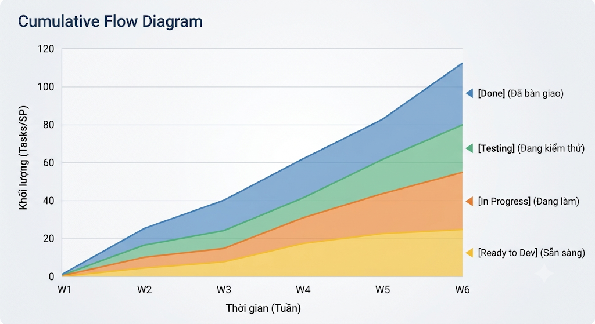

# 04-PROJECT-MONITORING-CONTROL: BÀI 07 - PROGRESS TRACKING (THEO DÕI TIẾN ĐỘ TỔNG THỂ DỰ ÁN)

## 1. KHUNG KIẾN THỨC CHUẨN PMP (PMBOK 6 & 7) & LIÊN HỆ THỰC TẾ

### A. Khái niệm theo chuẩn Quản trị Dự án Quốc tế (PMP)

Theo dõi tiến độ tổng thể (**Progress Tracking**) là quy trình đối chiếu liên tục giữa thực tế triển khai và kế hoạch đã phê duyệt nhằm phát hiện độ lệch (Variances), phân tích xu hướng (Trend Analysis) và đưa ra các hành động điều chỉnh (Corrective Actions) kịp thời.

* **PMBOK 6th Edition:**
* Trọng tâm nằm ở quy trình **Control Schedule** (Kiểm soát tiến độ) thuộc nhóm *Monitoring & Controlling*.
* Sử dụng Đường cơ sở Tiến độ (**Schedule Baseline**) làm mốc chuẩn. Tiến độ được định lượng qua chỉ số **Schedule Variance ($SV = EV - PV$)** và **Schedule Performance Index ($SPI = \frac{EV}{PV}$)**.
* Kiểm soát chặt chẽ **Đường găng (Critical Path Method - CPM)**: Mọi sự chậm trễ trên các công việc thuộc đường găng đều làm trễ hạn hoàn thành của toàn bộ dự án.


* **PMBOK 7th Edition & Agile/Hybrid:**
* Thuộc **Measurement Performance Domain** và **Delivery Performance Domain**.
* Chuyển dịch tư duy: Thay vì đếm khối lượng công việc hoàn thành một cách cơ học (% hoàn thành danh nghĩa), tiến độ được đo bằng **Khối lượng sản phẩm thực tế đã vận hành được (Working Deliverables/Increments)** mang lại giá trị kinh doanh.
* Sử dụng kết hợp giữa **Lộ trình sản phẩm (Product Roadmap)**, **Milestone Schedule** và **Biểu đồ dòng chảy tích lũy (Cumulative Flow Diagram - CFD)** để kiểm soát tốc độ luân chuyển công việc.


### B. Phân biệt Đo lường Tiến độ: Predictive (Truyền thống) vs. Agile/Hybrid (Hiện đại)

| Tiêu chí | Quản trị Truyền thống (Predictive) | Quản trị Linh hoạt (Agile / Hybrid) |
| --- | --- | --- |
| **Đơn vị đo lường** | % Hoàn thành công việc WBS, Số giờ công (Hours). | User Stories / Story Points hoàn thành $100\%$ theo DoD. |
| **Cơ chế kiểm soát** | Bám sát Gantt Chart & Đường cơ sở Baseline. | Bám sát Sprint Goals & Mục tiêu Cột mốc (Milestones). |
| **Công cụ trực quan** | Milestone Chart, S-Curve tiến độ, Tracking Gantt. | Release Burndown, CFD, Now-Next-Later Roadmap. |
| **Phản ứng khi trễ hạn** | Nén tiến độ (Crashing / Fast-tracking). | Cắt tỉa tính năng phụ (Scope Flexibility / De-scoping). |

---

## 2. CẤU TRÚC BỘ CÔNG CỤ & KHUNG FILE PROGRESS TRACKING (ARTIFACTS)

Để theo dõi tiến độ xuyên suốt từ cấp độ điều hành (Vĩ mô) đến cấp độ nhóm phát triển (Vi mô), một bộ công cụ theo dõi tiến độ chuẩn cần 2 cấu phần chính:

### A. Bảng Kiểm soát Cột mốc Trọng yếu (Milestone Tracking Matrix)

| Milestone ID | Tên Cột mốc / Hạng mục bàn giao chính | Ngày kế hoạch (Baseline Date) | Ngày dự báo (Forecast Date) | Trạng thái (RAG) | Người chịu trách nhiệm | Tiêu chí nghiệm thu cốt lõi (Gate Criteria) |
| --- | --- | --- | --- | --- | --- | --- |
| **M1** | Chốt kiến trúc hạ tầng & Core API Database | `15/03/2026` | `15/03/2026` | 🟢 Hoàn thành | Tech Lead | Kiến trúc chịu tải $5,000\text{ CCU}$ được duyệt |
| **M2** | Hoàn thành tích hợp Cổng thanh toán & Ví điện tử | `15/04/2026` | `22/04/2026` | 🔴 Trễ 7 ngày | PO / Dev Lead | Đã Test Sandbox & Khớp đối soát ngân hàng |
| **M3** | Closed Beta Test (Thử nghiệm nội bộ 200 phòng) | `01/05/2026` | `05/05/2026` | 🟡 Chú ý | QA Lead / PO | 0 Bug Critical; Crash-free $\ge 99.5\%$ |
| **M4** | Official Public Launching trên App Store / CH Play | `01/06/2026` | `01/06/2026` | 🟢 Đúng hạn | Product Owner | Đạt đầy đủ chuẩn kiểm duyệt phát hành |

---

### B. Biểu đồ Dòng chảy Tích lũy (Cumulative Flow Diagram - CFD)

CFD là công cụ phản ánh tiến độ theo thời gian thực (Real-time Progress Tracker) cho toàn bộ chu kỳ phát triển:

```
Khối lượng
(Tasks/SP)
 120 ──┐                                         ┌─── [Done] (Đã bàn giao)
 100   │                                   ┌─────┘
  80   │                            ┌──────┘ ◄─── [Testing] (Đang kiểm thử)
  60   │                     ┌──────┘ ◄────────── [In Progress] (Đang làm)
  40   │              ┌──────┘ ◄───────────────── [Ready to Dev] (Sẵn sàng)
  20   │       ┌──────┘
   0 ──┴───────┴───────┴───────┴───────┴───────┴───────► Thời gian (Tuần)
       W1      W2      W3      W4      W5      W6

```


* **Dải màu mở rộng bất thường (Swelling Band):** Cảnh báo nghẽn tiến độ tại một khâu cụ thể (ví dụ: dải `Testing` phình to đồng nghĩa Dev bàn giao dồn dập khiến QA không kịp xử lý).
* **Khoảng cách ngang (Horizontal Distance):** Đo lường thời gian từ lúc bắt đầu đến khi bàn giao (**Lead Time**). Lead Time càng ngắn, tiến độ dự án càng ổn định.

---

## 3. CÁC KỸ THUẬT NÉN TIẾN ĐỘ DỰ ÁN (SCHEDULE COMPRESSION)

Khi phát hiện dự án có nguy cơ trễ hạn so với đường cơ sở, chuẩn PMP quy định 2 kỹ thuật can thiệp chính:

### 1. Fast-Tracking (Thực hiện song song / Đi tắt)

* **Cơ chế:** Chuyển các hoạt động lẽ ra phải làm tuần tự sang làm song song cùng một lúc.
* **Ví dụ:** Cho phép đội Lập trình (Dev) bắt tay vào viết code khung API ngay khi UI/UX Designer hoàn thành Wireframe sơ bộ (thay vì đợi thiết kế UI hoàn chỉnh 100%).
* **Đặc tính:** **Không làm tăng chi phí**, nhưng **làm tăng rủi ro lỗi** và có thể dẫn đến làm lại (Rework) nếu thiết kế thay đổi.

### 2. Crashing (Bổ sung nguồn lực / Ép tiến độ)

* **Cơ chế:** Bơm thêm tài nguyên hoặc chi phí để rút ngắn thời gian làm việc của các tác vụ nằm trên đường găng.
* **Ví dụ:** Thuê thêm chuyên gia bên ngoài, trả tiền làm thêm giờ (OT) hoặc nâng cấp cấu hình máy chủ CI/CD.
* **Đặc tính:** Giảm thời gian thực hiện nhưng **làm tăng trực tiếp ngân sách** của dự án.

---

## 4. CASE STUDY THỰC TẾ: DỰ ÁN "EPIC CENTER"

* **Bối cảnh:** Dự án phát triển nền tảng ứng dụng Epic Center đặt mục tiêu bàn giao Cột mốc lớn **M2: Phát hành module Đặt phòng & Combo trải nghiệm** vào ngày 30/04/2026.
* **Tín hiệu cảnh báo tiến độ (Tuần thứ 6/10):**
* Đội Kỹ thuật thông báo: Module tích hợp cổng thanh toán trực tuyến bị vướng mắc kỹ thuật từ phía nhà cung cấp, dự kiến trễ **10 ngày làm việc** so với kế hoạch.
* Phân tích đường găng cho thấy: Tác vụ *"Kiểm thử luồng thanh toán"* nằm trực tiếp trên Critical Path; nếu trễ 10 ngày thì toàn bộ ngày ra mắt ứng dụng sẽ bị dời sang giữa tháng 5, bỏ lỡ dịp cao điểm du lịch lễ 30/4 - 1/5.


* **Chiến lược xử lý tiến độ tổng thể của Product Owner (Duy):**
1. **Áp dụng Fast-Tracking:** Trong khi chờ đối tác sửa lỗi cổng thanh toán, Duy chỉ đạo đội UI/UX và Mobile Dev tiến hành làm trước module *"Thông báo xác nhận đơn hàng"* và *"Lưu lịch sử vé đặt phòng"* (vốn dĩ được xếp làm sau khi cổng thanh toán chạy xong).
2. **Áp dụng Crashing có kiểm soát:** Phê duyệt trích $1,200 từ Quỹ dự phòng rủi ro (**Contingency Reserve**) để thuê 1 kỹ sư tích hợp cấp cao từ đối tác hỗ trợ gỡ lỗi trực tiếp trong 3 ngày.
3. **Cắt tỉa phạm vi tính năng (De-scoping):** Tạm thời đưa tính năng *"Tích hợp mã giảm giá nâng cao (Dynamic Promo Code)"* sang bản cập nhật sau ngày 15/5 để giảm tải 15 Story Points cho đội QA.


* **Kết quả:** Đợt phát hành M2 được hoàn tất vào đúng ngày **29/04/2026** (sớm hơn 1 ngày so với mốc hạn chót); hệ thống phục vụ an toàn cho hơn 8,000 lượt đặt chỗ trong kỳ nghỉ lễ.

---

## 5. CÁC TIPS & ĐIỀU LƯU Ý THỰC CHIẾN (ANTI-PATTERNS & SOLUTIONS)

| Sai lầm phổ biến (Anti-Pattern) | Hậu quả | Giải pháp thực chiến |
| --- | --- | --- |
| **"Hội chứng 90% hoàn thành" (The 90% Done Syndrome)** | Công việc đạt 90% rất nhanh nhưng kẹt ở 10% còn lại suốt nhiều tuần. | Áp dụng nguyên tắc nhị phân: **Chỉ có 0% hoặc 100% (Binary Tracking)** dựa trên Định nghĩa Hoàn thành (Definition of Done). |
| **Quản lý tiến độ bằng danh sách công việc vụn vặt** | Sa đà vào việc kiểm tra hàng trăm task nhỏ, mất góc nhìn tổng thể về các Cột mốc sống còn (Milestones). | Thiết lập cấu trúc theo dõi 2 tầng: **Tầng Milestone/Epic** cho Lãnh đạo & Khách hàng; **Tầng Task/User Story** cho đội ngũ thực thi. |
| **Tự ý đẩy nhanh tiến độ trên tác vụ không nằm trên Đường găng** | Tiêu tốn chi phí và công sức nhưng ngày kết thúc toàn bộ dự án vẫn không thay đổi. | Chỉ tập trung các biện pháp nén tiến độ (Crashing / Fast-tracking) vào các công việc **nằm trên Critical Path**. |
| **Giấu thông tin trễ hạn cho đến phút chót** | Ban điều hành và Khách hàng bị bất ngờ, mất hết phương án dự phòng xử lý rủi ro. | Thiết lập cơ chế **Cảnh báo sớm (Early Warning Triggers)**: Bất kỳ tác vụ nào trễ quá 2 ngày đều phải được gắn nhãn cảnh báo ngay tại buổi Daily Tracking. |

---

## 6. NGUỒN THAM KHẢO CHẤT LƯỢNG (BLOGS, BOOKS & YOUTUBE)

1. **Chuẩn quốc tế & Sách kinh điển:**
* *A Guide to the Project Management Body of Knowledge (PMBOK® Guide) – 6th & 7th Edition* (Chương *Project Schedule Management* & *Measurement Performance Domain*).
* *Practice Standard for Scheduling – 3rd Edition* (Project Management Institute).
* *Agile Project Management with Scrum* – Ken Schwaber.


2. **Blog chuyên ngành uy tín:**
* **ProjectManagement.com (PMI Portal):** *Schedule Control Techniques in Hybrid Project Environments*.
* **Atlassian Agile Coach:** *How to Read Cumulative Flow Diagrams (CFD) to Identify Bottlenecks*.
* **Roman Pichler Blog:** *Effective Product Progress Tracking using Goal-Oriented Roadmaps*.


3. **Kênh YouTube tham khảo:**
* **Praizion Performance Management:** Video *Critical Path Method (CPM) and Float Calculation for PMP Exam*.
* **ProjectManager:** Video *How to Track Project Progress Effectively*.
* **Agile Academy:** *Cumulative Flow Diagram (CFD) Explained for Agile Teams*.


---